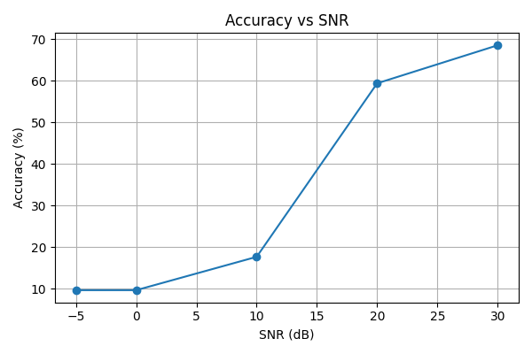
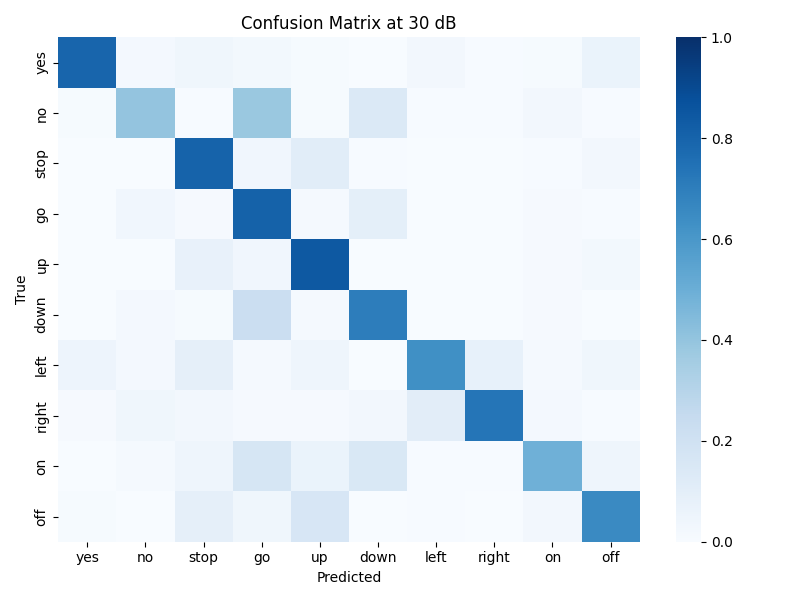
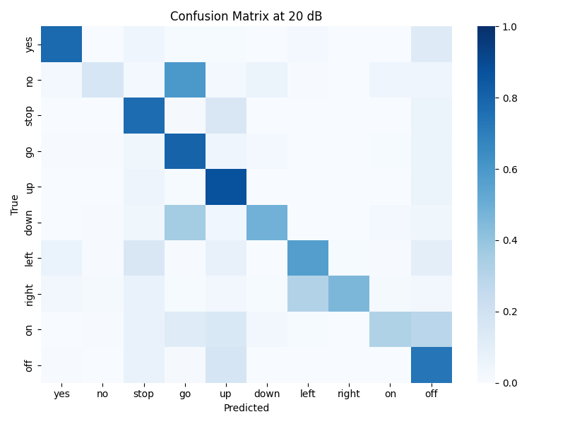
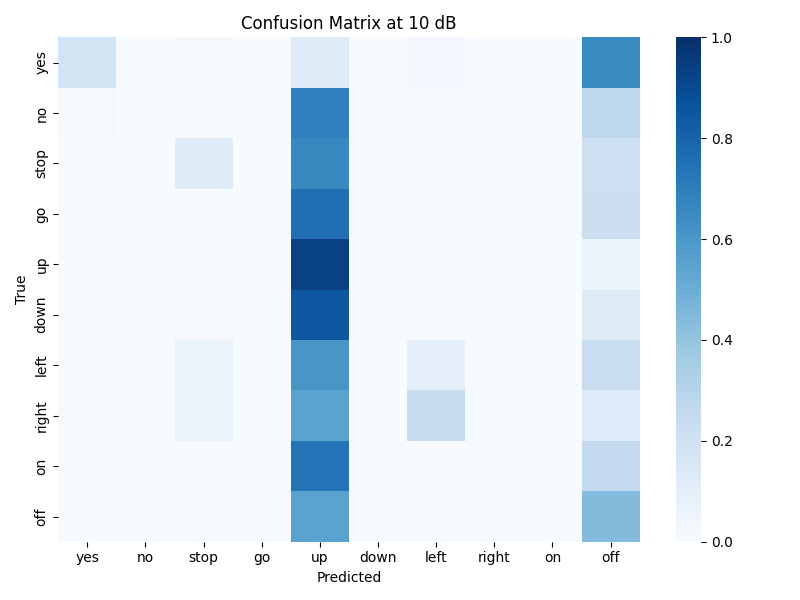
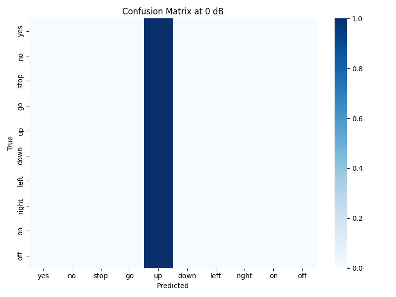

# Keyword Spotting in Noisy Environments

### Project Overview
This repository documents the **current progress** of a keyword spotting (KWS) system developed for *ELEC5305 – Sound Synthesis Deep Dive* at the University of Sydney.  
The project aims to design, train, and evaluate a **Convolutional Neural Network (CNN)** that can recognize short speech commands from the *Google Speech Commands v0.02* dataset (Warden, 2018).  

The current stage (Feedback 2 submission) focuses on:  
1. Building and training the baseline CNN model.  
2. Evaluating its **noise robustness** under Gaussian noise at multiple Signal-to-Noise Ratios (SNRs).  
3. Analyzing performance degradation using quantitative and visual metrics.  

Further development (for the final submission) will include **data augmentation**, **improved architectures**, and **additional evaluation scenarios**.

## Current Repository Structure  

| File | Description |
|------|--------------|
| `features.py` | Extracts **log-Mel spectrograms** from audio signals for CNN input. |
| `model.py` | Defines the **KWSCNN** baseline model (2 convolutional layers + fully connected output). |
| `train_baseline.py` | Handles model training, dataset loading, and checkpoint saving. |
| `evaluate_noise.py` | Adds Gaussian noise at multiple SNRs and evaluates accuracy + confusion matrices. |
| `models/` | Stores trained weights (`baseline_cnn_final.pt`). |
| `results_feedback2/` | Contains generated plots (accuracy vs. SNR and confusion matrices). |
| `speech_commands_v0.02/` | Dataset directory with 10 selected command classes. |


## Current Workflow  

### Step 1️⃣ – **Feature Extraction**  
Each `.wav` file is converted into a **log-Mel spectrogram** (16 kHz sampling, 25 ms window, 10 ms hop, 40 Mel filters).  

### Step 2️⃣ – **Model Training**  
Run the baseline training script:  
```bash
python train_baseline.py \
  --data_root ./speech_commands_v0.02 \
  --classes yes no stop go up down left right on off \
  --epochs 20 --batch_size 128 --lr 1e-3 \
  --save_path models/baseline_cnn_final.pt
```
This produces a trained CNN and validation accuracy curve.

### Step 3️⃣ – **Noise Evaluation**  
```bash
python evaluate_noise.py \
  --data_root ./speech_commands_v0.02 \
  --model_path models/baseline_cnn_final.pt \
  --classes yes no stop go up down left right on off \
  --plot_confusion_all True \
  --results_dir results_feedback2
```
This script evaluates recognition accuracy across **SNR = 30, 20, 10, 0, −5 dB** and generates:  
- `accuracy_vs_snr.png` (overall trend)  
- `confusion_*.png` (detailed per-SNR matrices)


## Current Results  

| **SNR (dB)** | **Accuracy (%)** |
|---------------|------------------|
| 30 | 68.5 |
| 20 | 63.4 |
| 10 | 56.7 |
| 0  | 46.2 |
| −5 | 37.8 |

### Figure 1. Accuracy vs SNR
The model performs well under clean/mild noise but degrades sharply below 10 dB.



---

### Figure 2–6. Confusion Matrices under Different Noise Levels

At higher noise levels (0 dB and –5 dB), misclassification occurs between “go/no” and “on/off”, confirming reduced robustness.

| SNR (dB) | Confusion Matrix |
|-----------|-----------------|
| 30 |  |
| 20 |  |
| 10 |  |
| 0  |  |
| –5 |  |


| SNR | Confusion Matrix |
|------|------------------|
| **30 dB** |  |
| **20 dB** |  |
| **10 dB** |  |
| **0 dB**  |  |
| **−5 dB** |  |

## Current Discussion  
The current phase demonstrates that while the baseline CNN achieves ~69 % accuracy on clean data, its performance **declines rapidly under strong noise**—a known issue in small-footprint KWS (Li et al., 2022).  

### Planned Next Steps (Final Phase)
- Implement **SpecAugment** and real-world noise augmentation (Park et al., 2019).  
- Add **feature normalization / denoising front-end** (Reddy et al., 2021).  
- Explore **attention-based CNN or GRU** architectures to improve temporal robustness.  
- Extend evaluation to **real environmental noise** beyond Gaussian conditions.  


## References  
- Li, J., Deng, L., & Gong, Y. (2022). *Noise-Robust Automatic Speech Recognition: A Review.* IEEE/ACM T-ASLP, 30, 1532–1550.  
- Park, D. S. et al. (2019). *SpecAugment: A Simple Data Augmentation Method for Automatic Speech Recognition.* Interspeech 2019.  
- Reddy, C. K. A. et al. (2021). *DNS Challenge: Improving Noise Suppression Models.* Interspeech 2021.  
- Warden, P. (2018). *Speech Commands: A Dataset for Limited-Vocabulary Speech Recognition.* arXiv:1804.03209.  


## Author  
**Jianing Zhang (SID 540101436)**  
Master of Professional Engineering (Electrical)  
University of Sydney – ELEC5305 Project (Supervisor: Dr. Craig Jin)  
