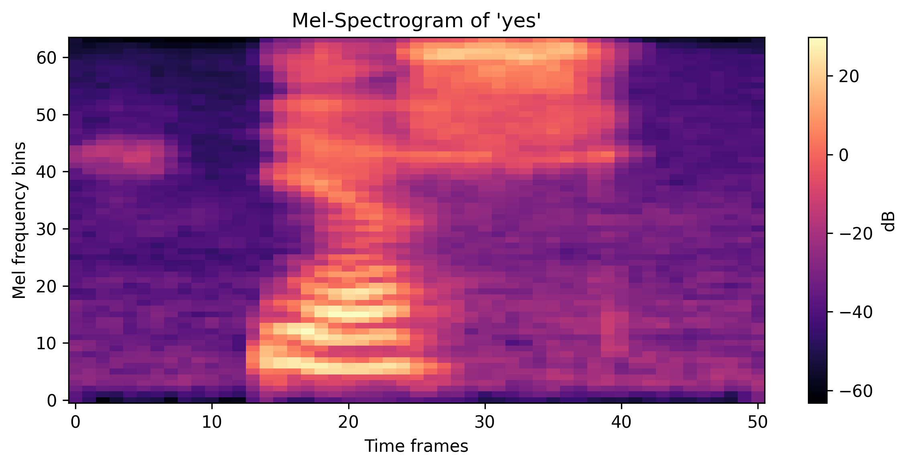
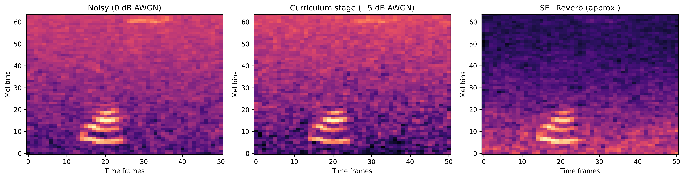

# 🎙️ Noise-Robust Keyword Spotting with ConvMixer

This repository contains the code for an ELEC5305 project on **noise-robust keyword spotting (KWS)** using a lightweight **ConvMixer** architecture.  
The system recognises short speech commands from the **Google Speech Commands v0.02** dataset under multiple noise conditions.

The project progressively builds from:

- a **clean baseline** model,
- a **noise-augmented AWGN** model,
- an extended **AWGN_v2** model with stronger noise,
- a **curriculum learning** strategy over SNR,
- and an **SE+Reverb** variant using speech enhancement and reverberation.

All experiments share the same backbone architecture to enable fair comparison.
---

## 📂 Folder Structure

```bash
noise_robust_kws_convmixer/
│
├── baseline/                # Baseline training & evaluation pipeline
├── experiments/             # Additional training strategies
│   ├── awgn/                # AWGN v1 and v2
│   ├── curriculum/          # Curriculum learning
│   └── se_reverb/           # Speech enhancement + reverb
│
├── data/                    # Place Speech Commands v0.02 here
│   └── readme.md            # Dataset download instructions
│
├── figures/                 # Project figures (mel-spectrogram, etc.)
│
├── runs/                    # All experiment outputs
│   ├── baseline_gpu_25ep/
│   ├── awgn/
│   ├── awgn_v2/
│   ├── curriculum/
│   ├── se_reverb/
│   ├── acc_snr.csv          # Combined results of all experiments
│   └── acc_snr.png          # Accuracy–SNR comparison plot
│
├── README.md                # Main project documentation
└── plot_melspec.py          # Script for generating mel-spectrogram

```
baseline/: code and config for the clean ConvMixer baseline.

experiments/awgn/: AWGN, AWGN_v2, curriculum and SE+Reverb experiments (all built on the same structure).

runs/: all trained checkpoints and evaluation outputs (CSV + plots) are written here.

data/SpeechCommands/: location of the Google Speech Commands dataset.

## ⚙️ 1. Environment and Data Setup
### 1.1 Create and activate conda environment

In any terminal:
```bash
conda create -n kws python=3.10
conda activate kws
```

### 1.2 Install dependencies
From the project root:
```bash
pip install torch torchaudio matplotlib pyyaml
```

### 1.3 Hardware environment
The experiments were run on:
```bash
GPU: NVIDIA RTX 4060 (8GB)
Framework: PyTorch (CUDA enabled)
```
(If CUDA is unavailable, the scripts will automatically fall back to CPU, but training will be significantly slower.)

### 1.4 Prepare dataset
Download Google Speech Commands v0.02 and place it under:
```bash
project_root/data/SpeechCommands/
```
he scripts will automatically handle train/validation/test splits using torchaudio’s interface.

### 1.5 Visualizing the Mel-Spectrogram (Figure 1)

To better understand the input features used by the ConvMixer keyword-spotting model, this project includes a visualization of a 64-bin Mel-spectrogram generated from a sample command (e.g., “yes”). The Mel-spectrogram provides a compact and perceptually meaningful time–frequency representation that serves as the model’s input during training and evaluation.

This visualization helps illustrate:

Low-frequency bands that carry most speech energy

High-frequency components related to formant transitions and consonants

The overall time–frequency structure the model learns to classify

Why Mel-spectrograms are robust and widely used in speech recognition pipelines

▶️ How to Generate the Mel-Spectrogram Figure

Run the provided plotting script from the project root directory:
```bash
conda activate kws
python plot_melspec.py
```
This script loads an example Speech Commands waveform, computes the Mel-spectrogram using the same parameters as the training pipeline (1024 FFT, 320 hop length, 64 Mel bins), converts it to log-amplitude scale, and visualizes it.

📍 Where the Figure Is Saved

The output image will be saved automatically as:

```bash
figures/melspec_yes.png
```


## 🚀 2. Run Baseline
📍 Terminal location: open a terminal in the baseline/ folder.

### 2.1 Train the baseline model
```bash
conda activate kws
python -m src.train --data_dir ../data --config ./configs/baseline.yaml --ckpt_dir ../runs/baseline_gpu_25ep
```

### 2.2 Evaluate robustness under noise
```bash
python -m src.eval_noise_sweep --data_dir ../data --config ./configs/baseline.yaml --ckpt ../runs/baseline_gpu_25ep/baseline_best.pt
```
Results will be automatically saved to:
```bash
runs/acc_snr.csv
```
### 2.3 Plot baseline Accuracy vs SNR
From the project root:
```bash
conda activate kws
python experiments/plot_acc_snr.py --csv runs/acc_snr.csv --out runs/acc_snr.png --title "Baseline"
```
This generates:
```bash
runs/acc_snr.png
```
containing the baseline accuracy–SNR curve


## 🔊 3. Run AWGN Experiment
This version adds Additive White Gaussian Noise (AWGN) during training to improve robustness.

### 3.1 Train the AWGN model
📍 Terminal location: open a terminal in experiments/awgn/.
```bash
conda activate kws
python -m src.train --data_dir ../../data --config ./configs/awgn_train.yaml --ckpt_dir ../../runs/awgn
```

### 3.2 Evaluate the model
```bash
python -m src.eval_noise_sweep --data_dir ../../data --config ./configs/awgn_train.yaml --ckpt ../../runs/awgn/awgn_best.pt
```
Results will append to:
```bash
runs/acc_snr.csv
```
### 3.3 Compare baseline vs AWGN
From the project root:
you can visualize the comparison:
```bash
python experiments/plot_acc_snr.py --csv runs/acc_snr.csv --out runs/acc_snr.png --title "Baseline vs AWGN"
```

## 🧩 4. Run AWGN_v2 (Improved Version)

This version deepens the model and extends the noise range to better handle low-SNR conditions.

### 4.1 Train the improved model
📍 Terminal location: open a terminal in experiments/awgn/.
```bash
conda activate kws
python -m src.train --data_dir ../../data --config ./configs/awgn_train_v2.yaml --ckpt_dir ../../runs/awgn_v2
```
### 4.2 Evaluate the model
```bash
python -m src.eval_noise_sweep --data_dir ../../data --config ./configs/awgn_train_v2.yaml --ckpt ../../runs/awgn_v2/awgn_best.pt
```
Results will append to:
```bash
runs/acc_snr.csv
```

### 4.3 Plot Accuracy vs SNR
After running baseline + AWGN + AWGN_v2, from the project root:
```bash
python experiments/plot_acc_snr.py --csv runs/acc_snr.csv --out runs/acc_snr.png --title "Baseline vs AWGN vs AWGN_v2"
```
The plot and CSV are saved to:
```bash
runs/acc_snr.csv
runs/acc_snr.png
```

## 📘 5. Curriculum Learning Training
This experiment trains the model using multi-stage SNR curriculum learning, where training starts at high SNR (easy) and gradually moves to low SNR (hard).
All settings are defined in:
experiments/curriculum/configs/curriculum_train.yaml

###🚀 5.1 Training (Curriculum Learning)
📍 Enter the curriculum folder：open a terminal in experiments/curriculum/.

Run the curriculum-learning training:

```bash
```bash
conda activate kws
python -m src.train --data_dir ../../data --config ./configs/curriculum_train.yaml --ckpt_dir ../../runs/curriculum
```
```

This will:

Train sequentially on SNR stages (e.g., 20 → 10 → 0 → –5 dB)

Save checkpoints to runs/curriculum/

Save the best model as

```bash
runs/curriculum/<tag>_best.pt
```

### 📊 5.2 Noise Robustness Evaluation

After training, evaluate the model under different SNR values.

Run from the curriculum experiment folder:

```bash
python -m src.eval_noise_sweep --data_dir ../../data --config ./configs/curriculum_train.yaml --ckpt ../../runs/curriculum/curriculum_best.pt
```
This script will:

Test the trained model at SNR = 20, 10, 0, –5 dB

Append results to:

```bash
runs/acc_snr.csv
```

### 📈 5.3 Plotting the Accuracy–SNR Curve

From the project root:
Use the unified plotting script:

```bash
python experiments/plot_acc_snr.py --csv runs/acc_snr.csv --out runs/acc_snr.png --title "Baseline vs AWGN vs Curriculum"
```

This generates:

```bash
runs/acc_snr.png
```

The plot will contain all experiments whose results are recorded in the CSV, such as:

baseline

awgn_train

awgn_train_v2

curriculum_train

### ✔ Expected Result Trend

Curriculum learning typically provides:

Slightly worse performance at very high noise (–5 dB) compared to AWGN v2

Clear improvement at moderate/high SNR (10–20 dB)

Smooth and stable SNR–Accuracy curve

## 📘 6. se_reverb Training

This experiment evaluates a speech enhancement + reverberation strategy.

### 6.1 Train the SE_Reverb model

📍 Terminal location: open a terminal in experiments/awgn/
From the `experiments/awgn` folder:

```bash
conda activate kws
python -m src.train --data_dir ../../data --config ./configs/se_reverb.yaml --ckpt_dir ../../runs/se_reverb
```

### 6.2 Evaluate noise robustness
```bash
python -m src.eval_noise_sweep --data_dir ../../data --config ./configs/se_reverb.yaml --ckpt ../../runs/se_reverb/se_reverb_best.pt
```

### 6.3 Plot final comparison including SE_Reverb
```bash
python experiments/plot_acc_snr.py --csv runs/acc_snr.csv --out runs/acc_snr.png --title "Baseline vs AWGN vs Curriculum vs se_reverb"
```

## 📊 Results Overview 
The overall results demonstrate that model robustness depends strongly on the chosen training strategy.
The clean baseline performs well in noise-free conditions but degrades quickly as SNR decreases.
Training with Gaussian noise (AWGN) provides moderate improvements, with AWGN_v2 showing slightly better low-SNR performance than AWGN_v1.
Curriculum learning consistently achieves the best accuracy across all noise levels, offering both high performance in clean conditions and strong resilience under severe noise.
In contrast, the SE_Reverb model performs worst across all SNRs due to enhancement artifacts and reverberation mismatch, confirming that inappropriate augmentation can harm robustness.
The combined accuracy–SNR plot clearly highlights these differences and visually illustrates the benefit of structured training over naive augmentation.
You can download or view the raw results here:

👉 [acc_snr.csv](runs/acc_snr.csv)

Below is the final accuracy–SNR comparison plot including all experiments:
The final accuracy–SNR comparison across all experiments (baseline, AWGN, AWGN_v2, curriculum, and SE+Reverb) is shown below:


### 📘 Visualizing Noisy / Curriculum / SE-Reverb Spectrograms

This project also includes an auxiliary script for visualizing how different processing methods
(noise corruption, curriculum training stages, and SE-Reverb) affect the time-frequency structure
of speech signals.

This script generates three side-by-side spectrograms:

Noisy speech (0 dB AWGN)

Curriculum-style corrupted speech (–5 dB AWGN)

SE + Reverb processed speech

These plots help explain the qualitative differences mentioned in the report
(e.g., transient consonant degradation, smoothing effects, reverberation smearing).

▶ How to Run

From the project root directory, run:
```bash
python plot_spectrogram_variants.py
```
### 📁 Output

The script will save the figure to:

```bash
figures/spectrogram_noisy_curriculum_sereverb.png
```

📌 Example Output

